# Simulador de Memória Virtual com Paginação por Demanda

**Trabalho Final de Sistemas Operacionais II**

---

## Integrantes da dupla
- Brenda Slongo Taca: 197402@upf.br
- Felipe Borges da Silva: 184387@upf.br

---

## Sumário
- [Descrição do Projeto](#descrição-do-projeto)
- [Tecnologias utilizadas](#tecnologias-utilizadas)
- [Dependências e pré-requisitos](#dependências-e-pré-requisitos)
- [Instruções de compilação e execução](#instruções-de-compilação-e-execução)
- [Decisões de projeto e arquitetura adotadas](#decisões-de-projeto-e-arquitetura-adotadas)
- [Exemplos de uso](#exemplos-de-uso)

---

## Descrição do projeto

Este projeto é um simulador em C++ que demonstra o funcionamento de **Memória Virtual com Paginação por Demanda**.  
O objetivo é implementar uma ferramenta didática para comparar algoritmos de substituição de páginas (FIFO, Ótimo, Clock) e observar métricas como número e taxa de *page faults*.

---

## Tecnologias utilizadas

- Linguagem: **C++** 
- Interface: Console / Terminal (uso de códigos ANSI para cor)

---

## Dependências e pré-requisitos

- Compilador C++ moderno
- Terminal que suporte codigo ANSI (Linux, macOS, Windows 10+ terminal)

---

## Instruções de compilação e execução

### Compilar o arquivo .cpp
```bash
g++ -std=c++17 -O2 simulador.cpp -o simulador
```

### Executar o simulador
```bash
./simulador
```

### Após a execução, o seguinte menu de configuração será exibido no terminal:


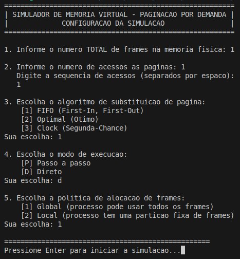

### Tutorial:
- **1. Número de frames**:
  - Informar o número 'x' de frames
- **2. Número de acesso às páginas**:
  - 2.1 Informar o número 'n' de páginas
   **Sequência de acessos**:
    - Informar as 'n' páginas, separadas por espaço
- **3. Algoritmo de alocação**:
  - FIFO (First-In, First-Out)
  - Optimal (Ótimo)
  - Clock (Segunda-Chance)
- **4. Modo de execução**:
  - Passo a passo (P): pausa a cada acesso
  - Direto (D): executa tudo e mostra resultado final
- **5. Politica de alocação de frames**:
  - Global: processo pode usar todos os frames
  - Local: processo tem partição fixa de frames (a substituição ocorre só nessa partição)

- **Enter para iniciar simulação**

---

### Saídas:
- **Métricas**: total de page faults e taxa de page faults
- **Interface de terminal**: saída com cores (ANSI) e log de eventos a cada passo

---

## Decisões de projeto e arquitetura adotadas

- **Tabela de Páginas com std::map:** Acabamos usando um std::map da STL para a Tabela de Páginas. A principal vantagem é a flexibilidade, pois o map não exige que os números das páginas virtuais sejam sequenciais (0, 1, 2...), o que permite simular sequências com números de página dispersos (ex: 7, 0, 1...), o que é mais realista.

- **Função simular() Centralizada:** Para evitar repetição de código, centralizamos a lógica principal em uma única função 'simular()'. As partes comuns a todos os algoritmos (como tratar Page Hits e procurar por frames livres) foram escritas uma vez só. A lógica de escolha da vítima em caso de Page Fault é tratada com um switch-case.

- **Implementação da Alocação Local:** A política de alocação local foi implementada com um vetor (frames_alocados_processo) que armazena os índices dos frames que pertencem à partição desse processo. As operações de busca por frames livres e seleção de vítima são feitas percorrendo somente os índices armazenados nesse vetor.

---

## Exemplos de uso

### Política Global:

**Configuração para simular o algoritmo FIFO com política global:**

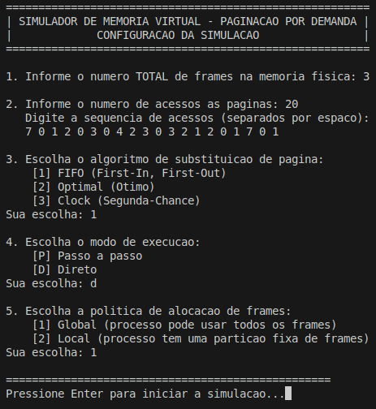


**Resultado da simulação:**

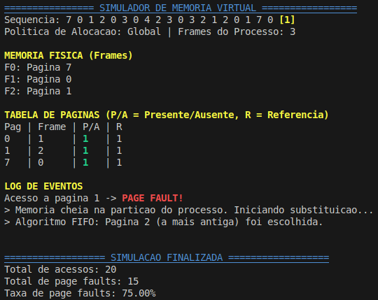

---

**Configuração para simular o algoritmo OPTIMAL com política global:**

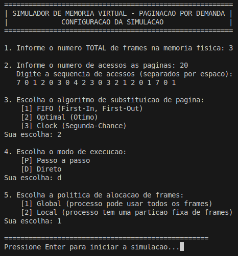


**Resultado da simulação:**

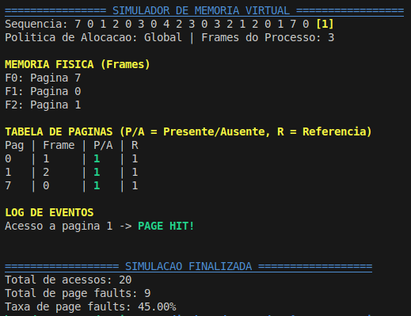

---

**Configuração para simular o algoritmo CLOCK com política global:**

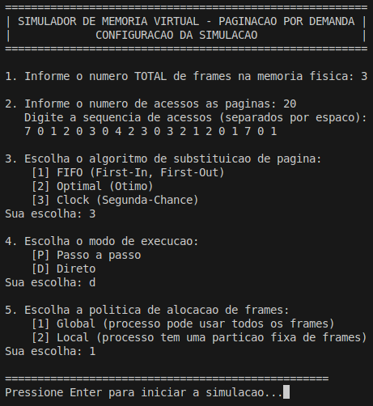


**Resultado da simulação:**

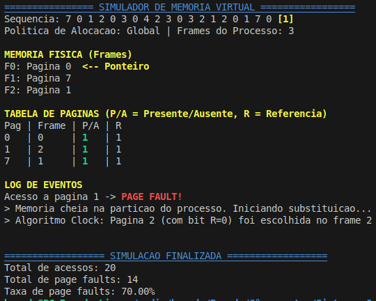


---
### Política Local:


**Configuração para simular o algoritmo FIFO com política local:**

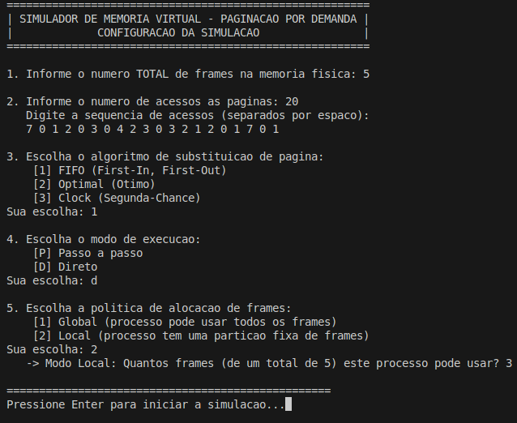


**Resultado da simulação:**

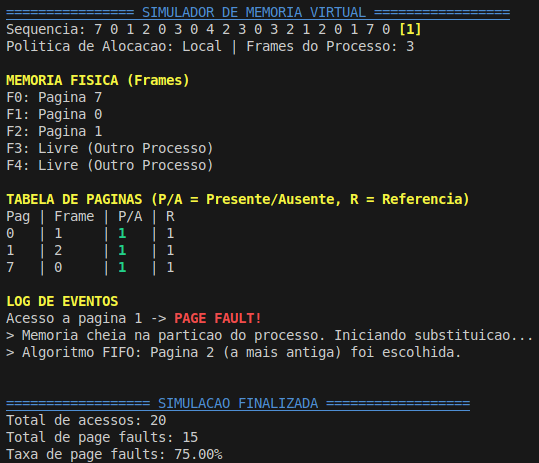

---

**Configuração para simular o algoritmo OPTIMAL com política local:**

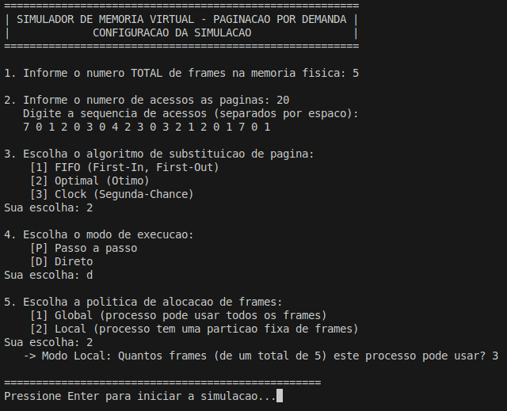


**Resultado da simulação:**

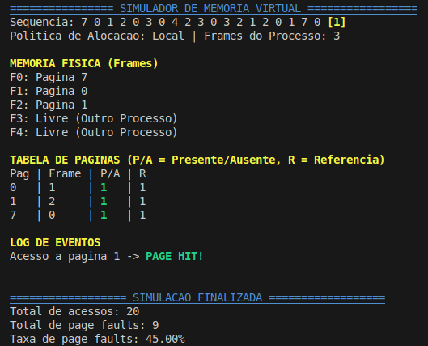

---

**Configuração para simular o algoritmo CLOCK com política local:**

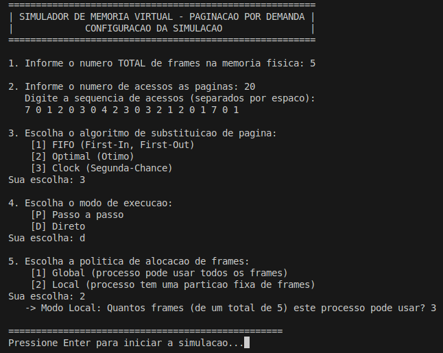


**Resultado da simulação:**

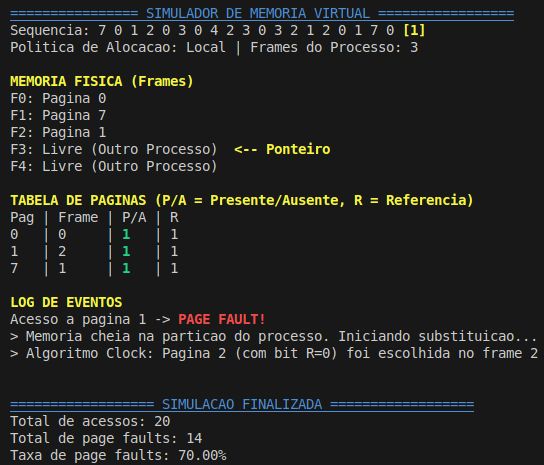

